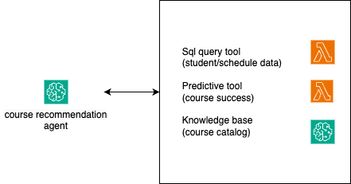

# Bedrock Agents for EDU Use Cases

This repository showcases example Bedrock Agents created for educational use cases.

## Repo Structure

- **Data:** Sample data that connects to the agents.
- **Tools:** Tools for agents to use.
- **Production:** Web UI and Bedrock agent integration.

## Agent Example 1: Course Recommendation Agent

- **Name:** Course Recommendation Agent
- **Target Audience:** Higher-Ed Student Advisors
- **Sample questions:** how many credits student 1 has earned? What courses are offerred this semester (202408) that's relevant to this student's major? Does this course conflict with student's schedule? What course do you recommend for student 1 to take this semester (202408) 

### Deployment Instructions

1. **Prepare Data:** 

1.1 ***Structured data:*** Run the `data-prep-course-recommendation-agent.ipynb` notebook to prepare the necessary data.

1.2 **Bedrock Knowledge Base:** 

Setting up OpenSearch Serverless (Collection, dashboard, index) - 
- Have access to your IAMUserArn. This can be obtained using Cloud9 command - `aws sts get-caller-identity --query Arn --output text` 
- Go to cloudformation on AWS Console and Upload the `OpenSearch-Serverless.yml` and enter the parameters like stack name and IAMUserArn (output of above command)
- Create Stack and wait for the resources to be created. 
- Once the stack is created, Go to the Amazon OpenSearch Service in the AWS Console, and under the Collections section, you will see the collection we just created. Click to open the collection “rag-bedrock-kb” and under the Indexes tab, click “Create vector index.” The default vector index name used by this template is - `rag-bedrock-index`. Add a field: `vector` dimension: `1024` engine:`faiss` distance: `Euclidean`
- Click create index and make sure index is created

Setting up Bedrock Knowledge Base - 
- We will need the outputs from OpenSearch-serverless stack to create this one in cloudformation. 
- Go to cloudformation on AWS Console and Upload the `Bedrock-Kb.yml` and enter the stack name. 
- Enter the parameters  `AmazonBedrockExecutionRoleForKnowledgeBasearn` , `CollectionARN` and `S3BucketName` as DataSource by fetching the values from output of previous stack. (Can be found under Outputs tab of previous Cloudformation Stack)
- And then click create Stack and the knowledge base will be created and ready for use. 

Upload sample document to S3 bucket (the one from previous step) -
- Download course catalog sample from here: https://www.portervillecollege.edu/_resources/assets/pdfs/Academics/2024-2025_Catalog.pdf 
- Upload the pdf to S3
- Sync Bedrock Knowledge Base

2. **Launch Agent:** Execute the `course-recommendation-agent.ipynb` notebook to deploy the agent in your AWS account.

### Architecture

